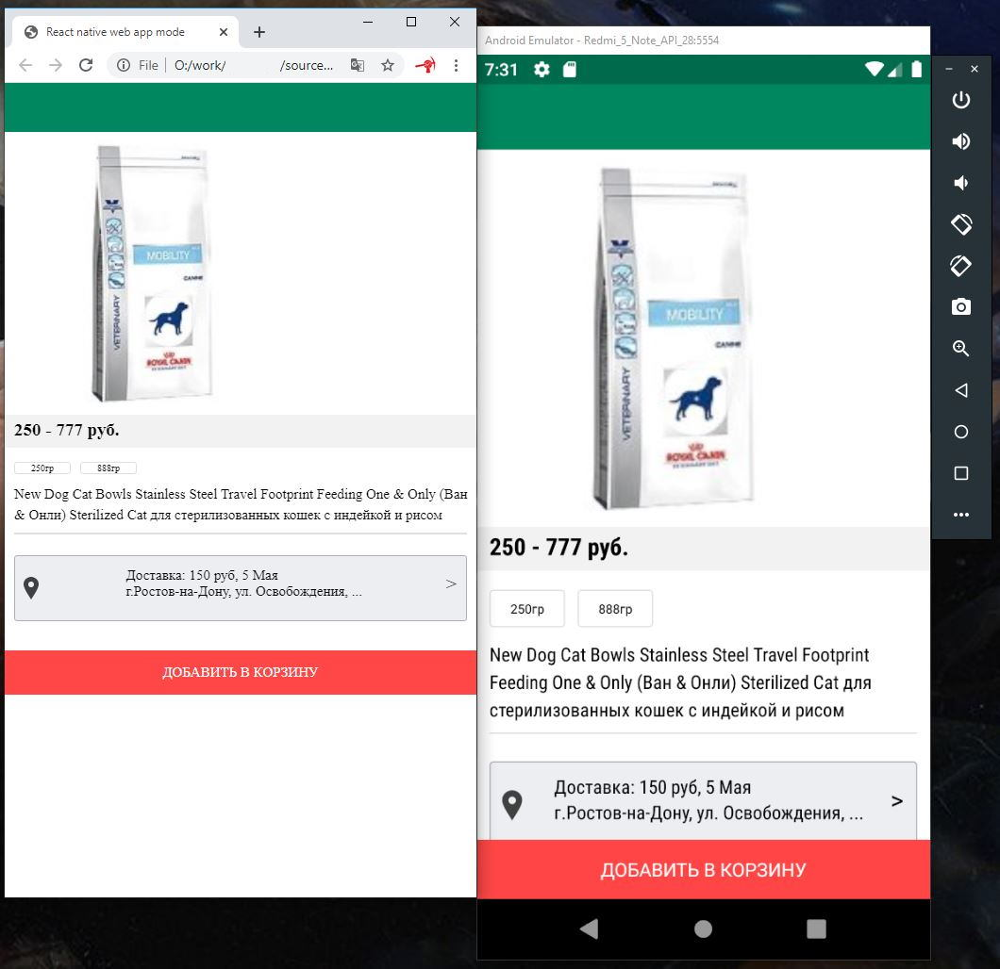

# React native shop

It is a monorepo based on yarn workspaces. It's used for the creation of Mobile React Native e-commerce application.
The programming language is Typescript. Os Windows.

(!) Some interfaces could be in Russian and have no translation yet.

# What it uses already

- React (with hooks), Redux (controls the global store), Redux ducks, Immutable, Axios
- Java dependent modules are injected into the core package. Core package supposed not to know anything about platform-dependent things like Java modules (unless they work fine in both web and mobile platforms)
- Metro for working for bundling the Android version and Webpack for the web version

# How it looks like

Click on the image below to make it bigger. Just a demo that Monorepo with react-native and react-native-web with all components and even theme in a dedicated package is possible. 

The Left side is a web version and right is an Android version. Yes, they look different as web version is used just to speed up developing process, but still, to make everything live together was a challengeable goal.

# Current activity

Check Issues to get know about planned changes https://github.com/KEMBL/react-native-shop/issues

For now, works:

    a) Monorepo
    b) The package with React-native application (Core)
    c) Android application package
    d) React components package
    e) Theme package
    f) Web application package for debug based on react-native-web

Famous problems were fixed:

    a) metro.config file content is not picked-up from a react-native package folder #6
    b) "Module AppRegistry is not a registered ..." #8
    c) "Invalid hook call ..." for react-hooks #9

# How to start the app

1. You should have installed Android studio: https://developer.android.com/studio

2. Download Dev branch

3. yarn

4. yarn android

After this, the Android emulator should start and you will see an example of the interface.

5. yarn web

That way web app could be bundled. Just open index.html from packages\rns-web-app\dist in a modern web browser. Many styles are not correct but this mode could be used for improving app logic without needing of android device/emulator. 

# Packages

- Components - context unrelated components like button, text formatters, image, etc

- RNS-Core - platform-independent application logics. Supposed to be started on mobile and Web platforms

- RNS-Theme - A visual style for RNS-Core

- RNS-Mobile-App - a consumer of all other packages - e-commerce mobile application (Android only for now)

- RNS-Web-App - web version of the mobile app, allows to debug app logic without mobile device or emulator

# Versioning

- A version consists of 3 numbers like this: 1.0.0

- If something was changed in any package or even new package added it changes: 1.0.\*

- If a new release was made it changes: 1._._
